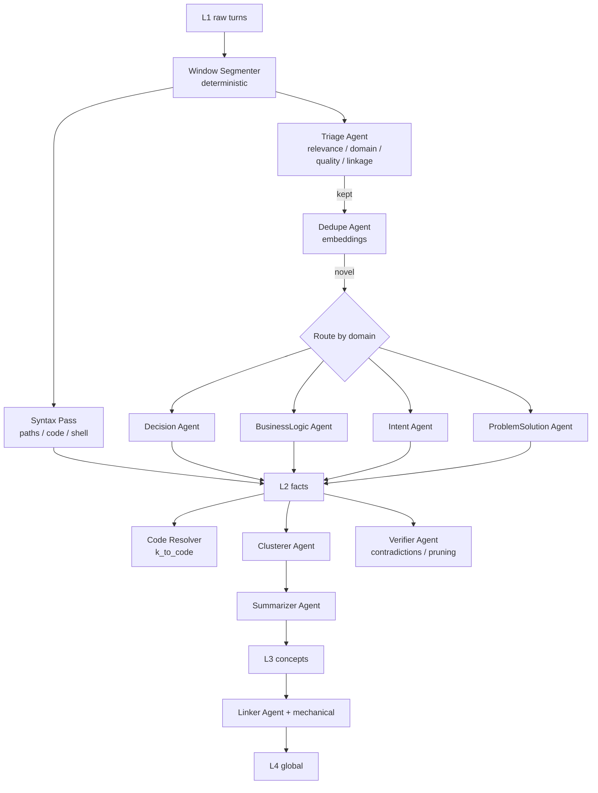

<div align="center">

# CodeGps

**A local, layered knowledge graph across your code and your AI agent conversations.**

[](https://github.com/tienan92it/CodeGps/actions/workflows/ci.yml)
[](./LICENSE)
[](https://nodejs.org/)
[](./CHANGELOG.md)

</div>

CodeGps indexes your code structure *and* the conversations you have with AI
coding agents (Cursor, Claude Code, Codex, Copilot) into one local knowledge
graph. An agent pipeline triages noise, extracts decisions and business rules,
clusters them into concepts, and links shared concepts across repositories.

Everything is local. SQLite for storage. Ollama is the default LLM backend; any
OpenAI-compatible endpoint works too.

---

## Quickstart

```bash
# 1. Install (Node 20+)
git clone https://github.com/tienan92it/CodeGps && cd CodeGps
npm install && npm run build && npm link        # exposes `codegps` on $PATH

# 2. Bring up a local LLM
ollama pull qwen3:4b-instruct                    # triage / classifier
ollama pull qwen2.5:14b                          # extractors / summarizer
ollama pull qwen3-embedding:0.6b                 # dedupe / clustering

# 3. Index a project
cd /path/to/your/project
codegps init                                     # creates .codegps/
codegps sync                                     # L0 — code structure
codegps ingest                                   # L1 → L3 — conversations + agents
codegps status                                   # see what landed in each layer
```

To make CodeGps callable from your AI agents, see [MCP integration](#mcp-integration).

---

## Architecture

### Layers

CodeGps splits "knowledge" into six layers along the DIKW pyramid. Each layer is
its own SQLite table family. Edges cross layers explicitly. **Syntax is
deterministic. Meaning is agent-driven.**

| Layer | Content | How it's produced |
|---|---|---|
| **L0** Code Structure | symbols, calls, imports, fields | deterministic (tree-sitter / regex DDL) |
| **L1** Conversations | sessions, turns, tool calls | deterministic (file parsers) |
| **L1.5** Triage | Relevance / Domain / Quality / Linkage per window | **agent** (Triage) |
| **L2** Facts | decisions, business rules, intents, problems / solutions | **agents** (Decision · BusinessLogic · Intent · ProblemSolution) + syntax pass |
| **L3** Concepts | clustered facts with names + structured summaries | **agents** (Clusterer · Summarizer) |
| **L4** Cross-Project | shared concepts between repos | mechanical (exact + SimHash) + **agent** (Linker) |

### Pipeline



### Hard rule

A regex can tell us *"this string looks like a file path."* A regex cannot tell
us *"this paragraph documents a business invariant."* Every such semantic
decision goes through a named agent with a versioned prompt and a JSON schema,
cached and audited via `agent_runs`. **There is no `if (text.includes("decided"))`
anywhere in the codebase.**

---

## What gets captured

### Languages (L0 code structure)

| Extension | Language | Engine |
|---|---|---|
| `.ts` `.tsx` `.mts` `.cts` `.js` `.jsx` `.mjs` `.cjs` | TypeScript / JavaScript | tree-sitter |
| `.py` | Python | tree-sitter |
| `.dart` | Dart | tree-sitter |
| `.go` | Go | tree-sitter |
| `.rs` | Rust | tree-sitter |
| `.java` | Java | tree-sitter |
| `.cs` | C# | tree-sitter |
| `.sql` `.ddl` | SQL DDL (tables, columns, FKs, views, indexes, functions) | regex parser |

### Conversation sources (L1)

| Source | Location | Notes |
|---|---|---|
| **Cursor** | `~/.cursor/projects/<slug>/agent-transcripts/<uuid>/<uuid>.jsonl` | full transcripts + tool calls |
| **Claude Code** | `~/.claude/projects/<slug>/*.jsonl` | full transcripts + tool calls |
| **Codex CLI** | `~/.codex/sessions/**/*.jsonl` | filtered by `cwd` metadata |
| **GitHub Copilot Chat** | VS Code workspace storage (best-effort) | partial — VS Code internals |

### Knowledge kinds (L2)

| Kind | Source | Use case |
|---|---|---|
| `decision` · `constraint` · `pattern` | Decision Agent | "What did we decide about caching?" |
| `business_rule` · `entity` · `constraint` · `pattern` | BusinessLogic Agent | "What invariants must refunds satisfy?" |
| `intent` | Intent Agent | "What was the user trying to do in this session?" |
| `problem` · `solution` | ProblemSolution Agent | "When did we hit this error last, and how was it fixed?" |
| `path_mention` · `code_block` · `shell_command` · `error_message` · `stack_trace` · `ticket_id` · `url` | Syntax pass | grounding evidence |

---

## CLI

```
codegps init [path]                # writes .codegps/{code.db,knowledge.db,config.json}
codegps sync [path] [--full]       # re-index code (L0)
codegps ingest [path] [--agent X]  # pull conversations + run agent pipeline (L1.5 → L3)
codegps serve [path] --mcp         # MCP server over stdio (code + knowledge tools)
codegps agents list                # list registered agents
codegps agents eval [--agent X]    # run golden test fixtures against the live LLM
codegps agents run <name> [path]   # run one agent over pending input (debug)
codegps canvas <kind> [path]       # generate .canvas.tsx (triage-audit / project-map / ...)
codegps link [path] [--rebuild]    # rebuild cross-project links (L4)
codegps triage audit [path]        # show triaged windows with labels and rationale
codegps verify [path]              # contradiction detection + low-confidence pruning
codegps status [path]              # counts per layer
```

---

## MCP integration

A single MCP server exposes 14 tools — both code (L0) and knowledge (L1.5–L3) —
over stdio. Drop into Cursor / Claude Code via:

```jsonc
// ~/.cursor/mcp.json  (or equivalent for Claude Code)
{
  "mcpServers": {
    "codegps": {
      "command": "codegps",
      "args": ["serve", ".", "--mcp"]
    }
  }
}
```

Available tools:

| Tool | Purpose |
|---|---|
| `codegps_search` | symbol search across code (name / kind / file:line) |
| `codegps_node` | one symbol's details (signature, docstring, location) |
| `codegps_context` | primary tool — facts + related code for a topic |
| `codegps_recall` | semantic + FTS query across past conversations |
| `codegps_decisions` | decisions / constraints / patterns for a topic or file |
| `codegps_business_logic` | business rules / invariants / entities |
| `codegps_concepts` | list or inspect L3 concepts |
| `codegps_explain` | structured systematic-thinking view of a concept |
| `codegps_link` | cross-project: where else this concept appears |
| `codegps_triage_audit` | inspect kept vs dropped windows + rationale |
| `codegps_verify` | run the Verifier sweep on demand |
| `codegps_ingest` | trigger incremental ingest |
| `codegps_sync` | trigger code re-index |
| `codegps_status` | counts per layer |

---

## Configuration

Per-agent model selection lives in `~/.codegps/config.json` (auto-created on
first `init`). Per-project overrides go in `<project>/.codegps/config.json`.

```jsonc
{
  "agentBackends": {
    "default":  { "kind": "ollama", "endpoint": "http://localhost:11434" },
    "frontier": { "kind": "openai-compatible", "endpoint": "https://api.openai.com/v1", "apiKeyEnv": "OPENAI_API_KEY" }
  },
  "agents": {
    "triage":          { "model": "default:qwen3:4b-instruct", "windowTokens": 2000 },
    "dedupe":          { "model": "default:qwen3-embedding:0.6b" },
    "decision":        { "model": "default:qwen2.5:14b", "fallback": "default:llama3.1:8b" },
    "businessLogic":   { "model": "default:qwen2.5:14b" },
    "intent":          { "model": "default:qwen3:4b-instruct" },
    "problemSolution": { "model": "default:qwen2.5:14b" },
    "clusterer":       { "model": "default:qwen3:4b-instruct" },
    "summarizer":      { "model": "default:qwen2.5:14b" },
    "linker":          { "model": "default:qwen2.5:14b" },
    "verifier":        { "model": "default:qwen2.5:14b" }
  }
}
```

Bumping a model invalidates that agent's cache on the next run; old runs stay
in `agent_runs` for audit.

### Recommended local models (M-series Mac, 24 GB)

| Agent role | Pick | Why |
|---|---|---|
| Classifier (triage, intent, clusterer) | `qwen3:4b-instruct` (~2.5 GB) | Best small-model JSON adherence in 2026 |
| Extractor (decision, businessLogic, summarizer, linker, verifier) | `qwen2.5:14b` Q4 (~9 GB) | Strongest structured extraction at this scale |
| Embeddings (dedupe) | `qwen3-embedding:0.6b` (~1 GB) | #1 on MTEB at this size, 32K context |

Combined hot footprint: ~12.5 GB, leaves ~10 GB headroom on a 24 GB machine.

### Frontier-quality routing (optional)

Add an `apiKeyEnv` backend and route only the hardest agents to it; the rest
stay local:

```jsonc
{
  "agents": {
    "decision":      { "model": "frontier:gpt-4o-mini", "fallback": "default:qwen2.5:14b" },
    "businessLogic": { "model": "frontier:gpt-4o-mini", "fallback": "default:qwen2.5:14b" },
    "linker":        { "model": "frontier:gpt-4o-mini", "fallback": "default:qwen2.5:14b" }
  }
}
```

---

## Cursor Canvases

`codegps canvas <kind>` generates a self-contained `.canvas.tsx` under
`<project>/.codegps/canvas/`. Open it in Cursor's canvas pane.

| Kind | Purpose |
|---|---|
| `triage-audit` | every triaged window with labels + rationale; filter by kept/dropped/domain |
| `project-map` | L3 concepts grouped with their member facts and L0 code links |
| `decision-timeline` | chronological view of decisions, business rules, problems/solutions |
| `business-logic` | domain rules and entities, grouped by concept |
| `cross-project-bridge` | shared concepts across two or more registered projects |

---

## Storage layout

```
<project>/.codegps/
├── code.db          # L0 — codegraph-compatible schema
├── knowledge.db     # L1, L1.5, L2, L3, agent_runs cache
├── canvas/          # generated .canvas.tsx files
└── config.json      # per-project agent overrides

~/.codegps/
├── global.db        # L4 — cross-project registry + concept_links
└── config.json      # global defaults
```

All files are local SQLite. Conversation transcripts are read in-place from
each agent's home directory — never copied.

---

## Trade-offs and non-goals

- **Local only.** No cloud sync. Embedding models and chat backends are
  pluggable but default to Ollama.
- **A local LLM is a hard runtime dependency.** Without one, only the
  deterministic syntax pass runs and L1.5 / L2 / L3 stay empty. This is
  intentional — the alternative is faking NL understanding with regex.
- **Cached, not deterministic.** Agent output is stable per
  `(agent, model, input_hash, prompt_version)`. Bumping the prompt version
  invalidates the cache by design.
- **Incremental clustering.** The Clusterer may drift over time;
  `codegps link --rebuild` triggers a full recompute.
- **No real-time chat hooks.** Ingestion is pull-based off transcript files;
  re-run `codegps ingest` (or trigger it via `codegps_ingest` from your agent)
  to pick up new sessions.
- **Code DB stays compatible with [codegraph](https://github.com/colbymchenry/codegraph).**
  Drop-in for existing codegraph users.

---

## Status & roadmap

**v0.1.0** — all six layers wired end-to-end. See [CHANGELOG.md](./CHANGELOG.md)
for the full surface. The plan and outstanding work live in
[`.cursor/plans/codegps_plan_82f6e65a.plan.md`](.cursor/plans/codegps_plan_82f6e65a.plan.md).

Likely next milestones:
- Additional languages with tree-sitter WASM already shipped (Swift, Kotlin, PHP, Ruby, C/C++)
- `sqlite-vec` integration for faster nearest-neighbour at scale
- File watcher for `serve --mcp` so the index stays fresh between agent turns
- LSP bridge so VS Code / Neovim users get the same tools as MCP-aware agents

---

## Contributing

```bash
npm install
npm run build       # tsc + copy schemas / canvas templates
npm test            # 59 unit + golden tests, ~600ms
npm run dev         # tsc --watch
```

Adding a language: add the extension to [`src/code/languages.ts`](src/code/languages.ts),
register handlers in [`src/code/extractor.ts`](src/code/extractor.ts), add a
test in [`__tests__/unit/code-extractor.test.ts`](__tests__/unit/code-extractor.test.ts).
~50 lines per language is typical.

Adding an agent: implement the `Agent<I, O>` interface in `src/agents/<name>.ts`,
register it via `src/agents/index.ts`, add a golden fixture under
`__tests__/agents/<name>/`, route it from the relevant pipeline file in
`src/pipeline/`. The runtime handles caching, schema validation, and persistence.

---

## License

MIT — see [LICENSE](./LICENSE).

## Acknowledgements

Inspired by [colbymchenry/codegraph](https://github.com/colbymchenry/codegraph)
(the L0 schema is intentionally compatible), the
[Model Context Protocol](https://modelcontextprotocol.io/) for the agent ↔ tool
interface, and tree-sitter for cross-language code parsing.
