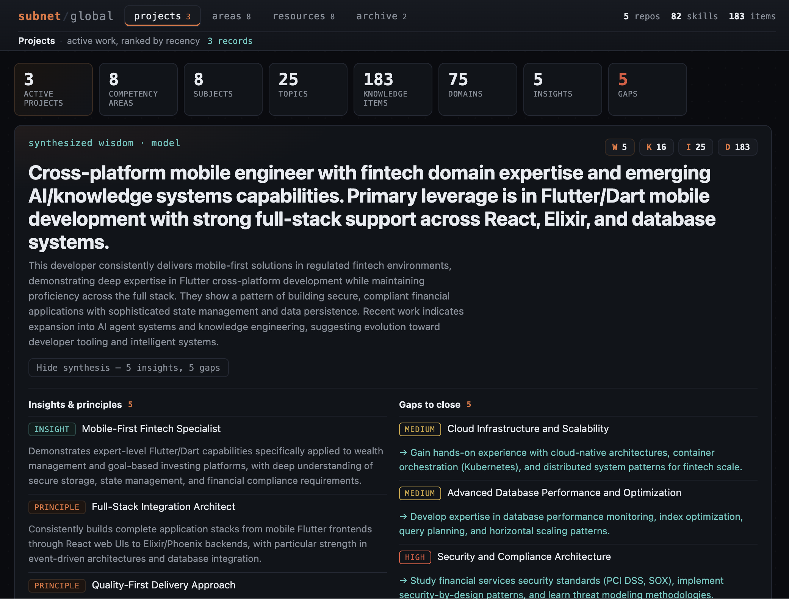
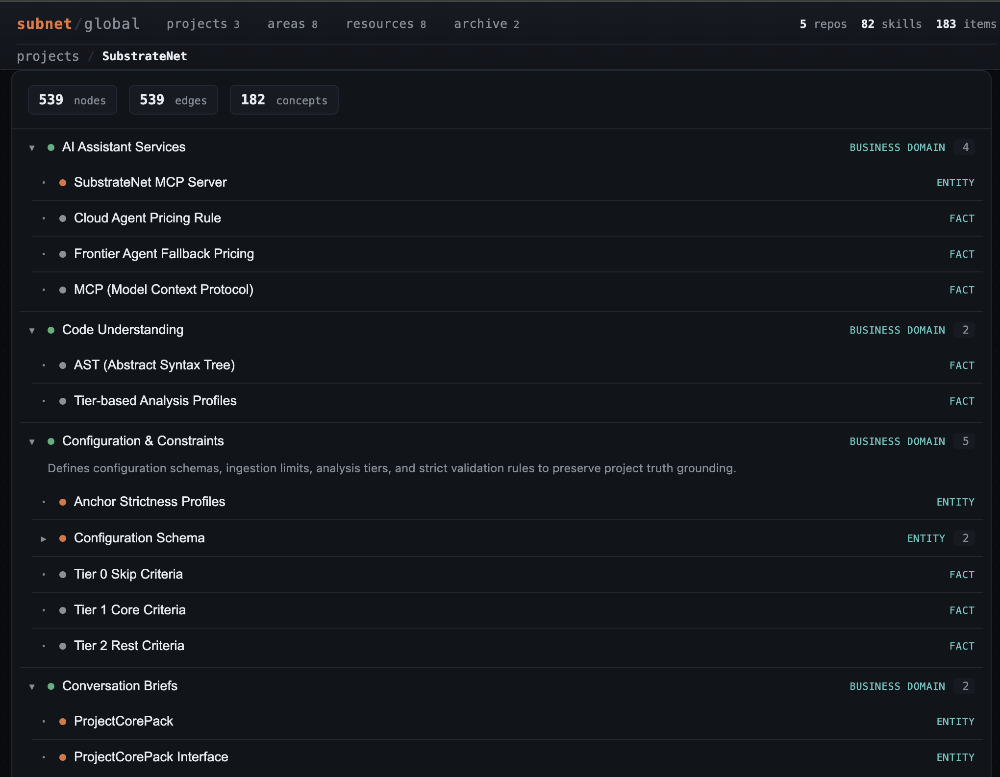

<div align="center">

# Substrate Net

**Cross-project skills. One local view.**

[](https://github.com/tienan92it/SubstrateNet/actions/workflows/ci.yml)
[](./LICENSE)
[](https://nodejs.org/)
[](./CHANGELOG.md)

**[Documentation →](https://tienan92it.github.io/SubstrateNet/)**

</div>

Substrate Net turns your code and AI agent conversations into a **cross-project
skill graph** you can query locally — skills, domain context, portfolio
highlights, and an interactive dashboard in one view.

An agent pipeline triages noise, extracts decisions and business rules,
clusters them into concepts, models the business domain, and aggregates what you
know across every registered project.

It follows a tree-sitter + LLM hybrid: the parser resolves the exact imports,
definitions, and call graph; the LLMs read that structure to produce summaries,
architectural layers, and business-domain knowledge — fewer tokens, fewer
hallucinations. An interactive local dashboard renders the whole graph from
SQLite.

The result is a queryable picture of your work along two axes: **technical**
(what the architecture objectively says) and **industry** (the business domain
your projects serve). Every node is tagged with its **grounding** — how it's
known — so project truth and inferred knowledge never blur together.

Everything is local. SQLite for storage. Ollama is the default LLM backend; any
OpenAI-compatible endpoint (OpenRouter, OpenAI, Together, Groq) works too.

## The dashboard

A self-contained, offline view built for humans. The global dashboard
(`subnet dashboard --global`) opens on a **Profile** — your cross-project skills,
industries, and portfolio highlights — and a **Map** of
`industry → business domain → tech domain → project` you can drill into. Each
project also renders its own **knowledge graph** (domains → concepts/entities →
rules/skills); the file dependency graph stays in `graph.json` for agents.

<table>
  <tr>
    <td width="50%"></td>
    <td width="50%"></td>
  </tr>
  <tr>
    <td align="center"><em>Profile — the second brain</em></td>
    <td align="center"><em>Map — cross-project knowledge graph</em></td>
  </tr>
</table>

---

## Quickstart

```bash
# 1. Install (Node 20+)
git clone https://github.com/tienan92it/SubstrateNet && cd SubstrateNet
npm install && npm run build:all && npm link   # exposes `subnet` on $PATH

# 2. Bring up a local LLM (or configure OpenRouter in ~/.substrate-net/config.json)
ollama pull qwen3:4b-instruct
ollama pull qwen2.5:14b
ollama pull qwen3-embedding:0.6b

# 3. One-shot setup: discover workspaces → estimate → run full pipeline
subnet setup
```

`subnet setup` scans Cursor, Claude Code, Codex, and VS Code/Cursor workspace
storage, lets you pick projects, shows a pre-flight cost/time estimate, then runs
init → sync → ingest → link → dashboard. Use `--projects /path/a,/path/b --yes`
for non-interactive runs.

**Per-step (advanced):**

```bash
cd /path/to/your/project
subnet init && subnet sync && subnet ingest && subnet link
subnet profile && subnet dashboard --open
```

To make Substrate Net callable from your AI agents, see [MCP integration](#mcp-integration).

---

## The model

Substrate Net splits "knowledge" into layers along the DIKW pyramid. Each layer is its
own SQLite table family; edges cross layers explicitly. **Syntax is
deterministic. Meaning is agent-driven.**

| Layer | Content | How it's produced |
|---|---|---|
| **L0** Code structure | symbols, calls, imports, fields, SQL tables | deterministic (tree-sitter / regex DDL) |
| **L0.5** Code analysis | per-file summaries, architectural layer, tags | tree-sitter structure → **agent** (FileAnalyzer · ArchitectureAnalyzer) |
| **L1** Conversations + docs + diagrams | sessions, turns, tool calls; in-repo docs (README / BRD / ADRs) and diagrams (mermaid / drawio / excalidraw / plantuml) | deterministic (file parsers + Docs/Diagrams adapters) |
| **L1.5** Triage | relevance / domain / quality / linkage / **activity** per window; **doc-kind** for source artifacts | **agents** (Triage · SourceClassifier) |
| **L2** Facts | decisions, business rules, intents, problems / solutions; BRD actors / processes / metrics; **incidents → root cause → resolution** | **agents** (Decision · BusinessLogic · Requirements · Intent · ProblemSolution · Incident) + syntax pass |
| **L2.5** Domain enrichment | dependencies, skills, entities, relationships, industry, components + lifecycles, gaps; cross-source **dedup + corroboration** | manifests + SQL (structural) · reconciler · fact-dedupe · **agents** (TechnicalProfiler · DomainModeler · ArchitectureModeler · IndustryClassifier · IndustryEnricher) |
| **L2.6** Knowledge zones | business domains + tech domains, grouping facts by bounded context / capability | **agents** (BusinessDomainModeler · TechDomainModeler) |
| **L3** Concepts | clustered facts with names + structured summaries, scope-tagged | **agents** (Clusterer · Summarizer) |
| **L4** Cross-project | shared concepts, **workspace umbrellas**, emergent project links | mechanical (exact + SimHash + shared-signal clustering) + **agent** (Linker) |
| **L5** Global skill graph + hierarchy | technical + industry skills, and the workspace → industry → business → tech → project zone tree | mechanical aggregation over L2.5/L2.6 evidence |

Agents run **tiered**: bulk work (triage, embeddings, extractors) stays on local Ollama; heavy reasoning (classification, domain/architecture modeling, linking, RCA) routes to a **Cursor SDK backend** (`frontier`, set `CURSOR_API_KEY`) and falls back to local automatically when unavailable.

### Scope × grounding

Two tags keep objective fact separate from inference:

- **scope** — `technical` (architecture) · `industry` (business domain) · `meta`
- **grounding** — how the claim is known:

| Grounding | Meaning | Source |
|---|---|---|
| `structural` | objective, parsed from artifacts | code symbols, SQL schema, manifests |
| `stated` | asserted in a conversation | extracted facts |
| `corroborated` | stated **and** matched to a code entity | the Reconciler |
| `external` | cited from outside the project | research backend (opt-in) |
| `model` | the agent's own inference | enrichment agents |

Project-truth queries default to `structural` / `stated` / `corroborated`.
`external` and `model` are opt-in and always filterable — so "fill the gap"
knowledge never gets mistaken for "what your project actually does."

---

## CLI

```
subnet setup [--projects ...] [--yes]  # discover workspaces → estimate → full pipeline
subnet init [path]                  # writes .substrate-net/{code.db,knowledge.db,config.json}
subnet sync [path] [--full]         # re-index code (L0)
subnet analyze [path] [--full]      # code-grounded LLM pass: file summaries + layers + tags
subnet ingest [path]                # conversations + agent pipeline + analyze + enrichment
  [--agent X] [--no-triage] [--no-extract] [--no-analyze] [--no-enrich] [--reprocess]
subnet enrich [path] [--no-agent]   # run the L2.5 enrichment pass on its own
subnet link [path] [--rebuild]      # rebuild cross-project links (L4) + skill graph (L5)
subnet skills [--scope X] [--cross] # global skill graph, weighted by evidence
subnet profile [--prose] [--out p]  # industries + top skills; --prose writes a portfolio
subnet learn [path]                 # industry-standard knowledge not yet in your work
subnet dashboard [path] [--open]    # per-project interactive graph dashboard
subnet dashboard --global [--open]  # cross-project hierarchy: industry → domain → project → file
subnet serve [path] --mcp           # MCP server over stdio
subnet status [path]                # counts per layer, with scope + grounding breakdown
subnet triage audit [path]          # show triaged windows with labels and rationale
subnet verify [path]                # contradiction detection + low-confidence pruning
subnet canvas <kind> [path]         # generate .canvas.tsx (triage-audit / project-map / ...)
subnet clean [path]                 # remove project data (--local-only / --global-only / --all)
subnet agents list | eval | run     # inspect / test / debug agents
```

The `dashboard` command needs the viewer bundle built once: `npm run build:dashboard`
(or `npm run build:all`). It then emits a single self-contained `index.html` (graph
inlined) plus a shareable `graph.json` to `<project>/.substrate-net/dashboard/`. With
`--global` it reads `~/.substrate-net/global.db` (populated by `subnet link`) and
writes the cross-project hierarchy to `~/.substrate-net/dashboard/` — an
overview-to-detail view that merges shared business and tech domains across projects
and drills into each project's file graph.

`ingest` is incremental: it only processes newly pulled windows. Use
`--reprocess` to re-run the pipeline over **all** existing windows after a model
swap or an interrupted run.

---

## MCP integration

A single MCP server exposes 25 tools — code (L0/L0.5), knowledge (L1.5–L3), domain
(L2.5), the global skill view (L4–L5), and a research surface
(`subnet_requirements`, `subnet_incidents`, `subnet_workspace`, `subnet_ask`) — over stdio:

```jsonc
// ~/.cursor/mcp.json  (or equivalent for Claude Code)
{
  "mcpServers": {
    "subnet": {
      "command": "subnet",
      "args": ["serve", ".", "--mcp"]
    }
  }
}
```

Primary tools: `subnet_context` (facts + code for a topic), `subnet_recall`
(semantic + FTS over conversations), `subnet_domain_model`, `subnet_gaps`,
`subnet_skills`, `subnet_profile`, `subnet_learn`, plus the research surface —
`subnet_ask` (grounded Q&A), `subnet_requirements`, `subnet_incidents` (RCA),
and `subnet_workspace` (umbrella + related projects). Full catalogue in the
[MCP docs](https://tienan92it.github.io/SubstrateNet/mcp.html).

---

## Configuration

Per-agent model selection lives in `~/.substrate-net/config.json` (auto-created on
first `init`). Per-project overrides go in `<project>/.substrate-net/config.json` and
deep-merge over global.

```jsonc
{
  "concurrency": 8,
  "agentBackends": {
    "local":      { "kind": "ollama", "endpoint": "http://localhost:11434" },
    "openrouter": {
      "kind": "openai-compatible",
      "endpoint": "https://openrouter.ai/api/v1",
      "apiKeyEnv": "OPENROUTER_API_KEY"   // name of the env var holding the key
    }
  },
  "agents": {
    "triage":            { "model": "openrouter:google/gemini-2.5-flash" },
    "dedupe":            { "model": "local:nomic-embed-text" },
    "businessLogic":     { "model": "openrouter:anthropic/claude-sonnet-4", "fallback": "local:qwen2.5:14b" },
    "technicalProfiler": { "model": "openrouter:anthropic/claude-sonnet-4" },
    "industryClassifier":{ "model": "openrouter:anthropic/claude-sonnet-4" }
    // ... decision, problemSolution, domainModeler, industryEnricher,
    //     clusterer, summarizer, linker, verifier, skillSynthesizer
  }
}
```

See [`frontier.config.example.json`](./frontier.config.example.json) for a
full local-plus-frontier split.

> **API keys.** `apiKeyEnv` is the *name of an environment variable*, not the
> key itself — the backend reads `process.env[apiKeyEnv]`. To paste a key
> directly, use the `apiKey` field instead. Prefer `apiKeyEnv` to keep secrets
> out of the config file.

Bumping a model invalidates that agent's cache on the next run; old runs stay in
`agent_runs` for audit.

---

## Storage layout

```
<project>/.substrate-net/
├── code.db          # L0 — codegraph-compatible schema
├── knowledge.db     # L1, L1.5, L2, L2.5, L3 + agent_runs cache
├── canvas/          # generated .canvas.tsx files
└── config.json      # per-project agent overrides

~/.substrate-net/
├── global.db        # L4 links + L5 skills / industries + project registry
└── config.json      # global defaults
```

All files are local SQLite. Conversation transcripts are read in-place from each
agent's home directory — never copied.

---

## Contributing

```bash
npm install
npm run build       # tsc + copy schemas / canvas templates
npm test            # unit + golden tests
npm run dev         # tsc --watch
```

Adding a language: add the extension to [`src/code/languages.ts`](src/code/languages.ts),
register handlers in [`src/code/extractor.ts`](src/code/extractor.ts), add a test
in [`__tests__/unit/code-extractor.test.ts`](__tests__/unit/code-extractor.test.ts).
~50 lines per language is typical.

Adding an agent: implement the `Agent<I, O>` interface in `src/agents/<name>.ts`,
register it via `src/agents/index.ts`, add a golden fixture under
`__tests__/agents/<name>/`, route it from the relevant pipeline file in
`src/pipeline/`. The runtime handles caching, schema validation, and persistence.

---

## License

MIT — see [LICENSE](./LICENSE).

## Acknowledgements

Inspired by [colbymchenry/codegraph](https://github.com/colbymchenry/codegraph)
(the L0 schema is intentionally compatible), the
[Model Context Protocol](https://modelcontextprotocol.io/) for the agent ↔ tool
interface, and tree-sitter for cross-language code parsing.
